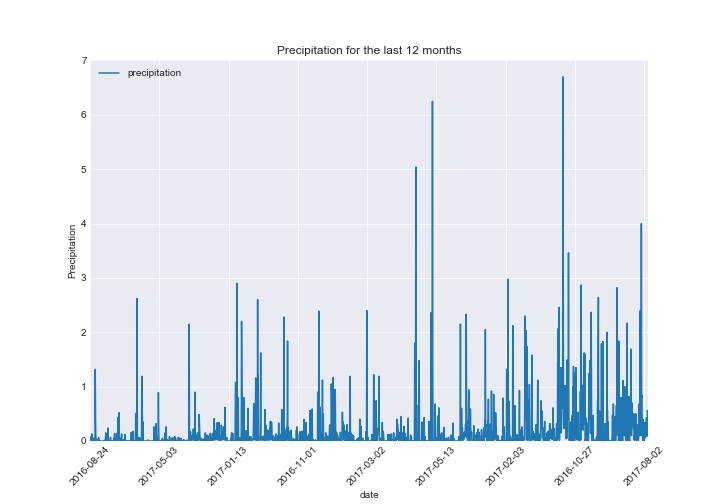
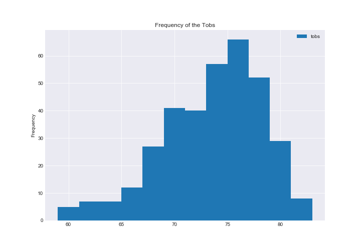
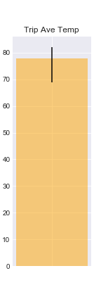

# HW11---Adv-Data-Storage-Retrieval
# Surfs Up!
<!--lint enable no-heading-punctuation-->
## Step 1 - Data Engineering

The climate data for Hawaii is provided through two CSV files. Start by using Python and Pandas to inspect the content of these files and clean the data.

```python
 # Dependencies
import pandas as pd
import numpy as np
import os
```


```python
 # Read CSV file into a pandas DataFrame
measurements = pd.read_csv ("Instructions\Resources\hawaii_measurements.csv")
stations = pd.read_csv ("Instructions\Resources\hawaii_stations.csv")
```


```python
# Review measurements datatypes of the file to inspect any data problem
measurements.dtypes
```


    station     object
    date        object
    prcp       float64
    tobs         int64
    dtype: object


```python
# Review stations datatypes of the file to inspect any data problem
stations.dtypes
```


    station       object
    name          object
    latitude     float64
    longitude    float64
    elevation    float64
    dtype: object


```python
# Review data total count of the file to inspect any data problem (found missing data)
measurements.count()   
```


    station    19550
    date       19550
    prcp       18103
    tobs       19550
    dtype: int64


```python
# Use `dropna` to drop any rows where there is missing data / reset data
measurements = measurements.dropna(axis=0).reset_index(drop=True)
measurements.count()
```


    station    18103
    date       18103
    prcp       18103
    tobs       18103
    dtype: int64


```python
# check new datafram 
# Create Index for each row using reset index
measurements = measurements.reset_index(drop=False)
measurements.head()
```


<div>
<style>
    .dataframe thead tr:only-child th {
        text-align: right;
    }

    .dataframe thead th {
        text-align: left;
    }

    .dataframe tbody tr th {
        vertical-align: top;
    }
</style>
<table border="1" class="dataframe">
  <thead>
    <tr style="text-align: right;">
      <th></th>
      <th>index</th>
      <th>station</th>
      <th>date</th>
      <th>prcp</th>
      <th>tobs</th>
    </tr>
  </thead>
  <tbody>
    <tr>
      <th>0</th>
      <td>0</td>
      <td>USC00519397</td>
      <td>2010-01-01</td>
      <td>0.08</td>
      <td>65</td>
    </tr>
    <tr>
      <th>1</th>
      <td>1</td>
      <td>USC00519397</td>
      <td>2010-01-02</td>
      <td>0.00</td>
      <td>63</td>
    </tr>
    <tr>
      <th>2</th>
      <td>2</td>
      <td>USC00519397</td>
      <td>2010-01-03</td>
      <td>0.00</td>
      <td>74</td>
    </tr>
    <tr>
      <th>3</th>
      <td>3</td>
      <td>USC00519397</td>
      <td>2010-01-04</td>
      <td>0.00</td>
      <td>76</td>
    </tr>
    <tr>
      <th>4</th>
      <td>4</td>
      <td>USC00519397</td>
      <td>2010-01-07</td>
      <td>0.06</td>
      <td>70</td>
    </tr>
  </tbody>
</table>
</div>


```python
 # Save the cleaned data to a file called `customers_cleaned.csv`
measurements.to_csv("Clean_Data/clean_hawaii_measurements.csv",index=False)
```


```python
# identify if there are any duplicate data 
# step 1 of 2 inspect the unique rows of the data
stations.nunique()
```


    station      9
    name         9
    latitude     9
    longitude    9
    elevation    9
    dtype: int64


```python
# identify if there are any duplicate data 
# step 2 of 2 inspect the total rows of the data
# found no duplicate - station data is good 
stations.count()
```


    station      9
    name         9
    latitude     9
    longitude    9
    elevation    9
    dtype: int64


```python
# review full stations data again to make sure
stations
```


<div>
<style>
    .dataframe thead tr:only-child th {
        text-align: right;
    }

    .dataframe thead th {
        text-align: left;
    }

    .dataframe tbody tr th {
        vertical-align: top;
    }
</style>
<table border="1" class="dataframe">
  <thead>
    <tr style="text-align: right;">
      <th></th>
      <th>station</th>
      <th>name</th>
      <th>latitude</th>
      <th>longitude</th>
      <th>elevation</th>
    </tr>
  </thead>
  <tbody>
    <tr>
      <th>0</th>
      <td>USC00519397</td>
      <td>WAIKIKI 717.2, HI US</td>
      <td>21.27160</td>
      <td>-157.81680</td>
      <td>3.0</td>
    </tr>
    <tr>
      <th>1</th>
      <td>USC00513117</td>
      <td>KANEOHE 838.1, HI US</td>
      <td>21.42340</td>
      <td>-157.80150</td>
      <td>14.6</td>
    </tr>
    <tr>
      <th>2</th>
      <td>USC00514830</td>
      <td>KUALOA RANCH HEADQUARTERS 886.9, HI US</td>
      <td>21.52130</td>
      <td>-157.83740</td>
      <td>7.0</td>
    </tr>
    <tr>
      <th>3</th>
      <td>USC00517948</td>
      <td>PEARL CITY, HI US</td>
      <td>21.39340</td>
      <td>-157.97510</td>
      <td>11.9</td>
    </tr>
    <tr>
      <th>4</th>
      <td>USC00518838</td>
      <td>UPPER WAHIAWA 874.3, HI US</td>
      <td>21.49920</td>
      <td>-158.01110</td>
      <td>306.6</td>
    </tr>
    <tr>
      <th>5</th>
      <td>USC00519523</td>
      <td>WAIMANALO EXPERIMENTAL FARM, HI US</td>
      <td>21.33556</td>
      <td>-157.71139</td>
      <td>19.5</td>
    </tr>
    <tr>
      <th>6</th>
      <td>USC00519281</td>
      <td>WAIHEE 837.5, HI US</td>
      <td>21.45167</td>
      <td>-157.84889</td>
      <td>32.9</td>
    </tr>
    <tr>
      <th>7</th>
      <td>USC00511918</td>
      <td>HONOLULU OBSERVATORY 702.2, HI US</td>
      <td>21.31520</td>
      <td>-157.99920</td>
      <td>0.9</td>
    </tr>
    <tr>
      <th>8</th>
      <td>USC00516128</td>
      <td>MANOA LYON ARBO 785.2, HI US</td>
      <td>21.33310</td>
      <td>-157.80250</td>
      <td>152.4</td>
    </tr>
  </tbody>
</table>
</div>


```python
stations.to_csv("Clean_Data/clean_hawaii_stations.csv",index=False)
```

---

## Step 2 - Database Engineering

Use SQLAlchemy to model your table schemas and create a sqlite database for your tables. You will need one table for measurements and one for stations.


```python
# Dependencies
import pandas as pd
import numpy as np
import os
```


```python
# Remove hawaii.sqlite if exists
os.remove("hawaii.sqlite")
```


```python
# Use Pandas to read the cleaned measurements and stations CSV data
measurements = pd.read_csv ("Clean_Data\clean_hawaii_measurements.csv")
stations = pd.read_csv ("Clean_Data\clean_hawaii_stations.csv")
```


```python
# Python SQL toolkit and Object Relational Mapper
import sqlalchemy
from sqlalchemy import create_engine, MetaData
from sqlalchemy.ext.declarative import declarative_base
from sqlalchemy import Column, Integer, String, Numeric, Text, Float, Date
```


```python
# Create an engine to a SQLite database file called `hawaii.sqlite`
engine = create_engine("sqlite:///hawaii.sqlite")
```


```python
 # Create a connection to the engine called `conn`
conn = engine.connect()
```


```python
# Use `declarative_base` from SQLAlchemy to model the demographics table as an ORM class
Base = declarative_base()

# Create ORM Class `Measurement` for `measurements` table
class Measurement(Base):
    __tablename__ = 'measurements'

    index = Column(Integer, primary_key=True)
    station = Column(Text)
    date = Column(Text)
    prcp = Column(Float)
    tobs = Column(Integer)
   
    def __repr__(self):
        return f"id={self.id}, name={self.name}"
        #return f"index={self.index}, station={self.station}, date={self.date}, prcp={self.prcp}, tobs={self.tobs}"

# Create ORM Class `Station` for `stations` table
class Station(Base):
    __tablename__ = 'stations'
 
    station = Column(Text, primary_key=True)
    name = Column(Text)
    latitude = Column(Float)
    longitude = Column(Float)
    elevation = Column(Float)
   
    def __repr__(self):
        return f"id={self.id}, name={self.name}"
        #return f"index={self.index}, station={self.station}, date={self.date}, prcp={self.prcp}, tobs={self.tobs}"
```


```python
 # Use `create_all` to create the Measurement anda Station tables in the database
Base.metadata.create_all(engine)
```


```python
 # Use Orient='records' to create a list of data to write
Mdata = measurements.to_dict(orient='records')
Sdata =stations.to_dict(orient='records')
```


```python
 # Data is just a list of dictionaries that represent each row of data
print(Mdata[:5])
print(Sdata[:5])
```

    [{'index': 0, 'station': 'USC00519397', 'date': '2010-01-01', 'prcp': 0.08, 'tobs': 65}, {'index': 1, 'station': 'USC00519397', 'date': '2010-01-02', 'prcp': 0.0, 'tobs': 63}, {'index': 2, 'station': 'USC00519397', 'date': '2010-01-03', 'prcp': 0.0, 'tobs': 74}, {'index': 3, 'station': 'USC00519397', 'date': '2010-01-04', 'prcp': 0.0, 'tobs': 76}, {'index': 4, 'station': 'USC00519397', 'date': '2010-01-07', 'prcp': 0.06, 'tobs': 70}]
    [{'station': 'USC00519397', 'name': 'WAIKIKI 717.2, HI US', 'latitude': 21.2716, 'longitude': -157.8168, 'elevation': 3.0}, {'station': 'USC00513117', 'name': 'KANEOHE 838.1, HI US', 'latitude': 21.4234, 'longitude': -157.8015, 'elevation': 14.6}, {'station': 'USC00514830', 'name': 'KUALOA RANCH HEADQUARTERS 886.9, HI US', 'latitude': 21.5213, 'longitude': -157.8374, 'elevation': 7.0}, {'station': 'USC00517948', 'name': 'PEARL CITY, HI US', 'latitude': 21.3934, 'longitude': -157.9751, 'elevation': 11.9}, {'station': 'USC00518838', 'name': 'UPPER WAHIAWA 874.3, HI US', 'latitude': 21.4992, 'longitude': -158.0111, 'elevation': 306.6}]
    


```python
 # Use MetaData from SQLAlchemy to reflect the tables
metadata = MetaData(bind=engine)
metadata.reflect()
```


```python
 # Save the reference to the `measurements` `stations` table as a variable called `Mtable` `Stable`
Mtable = sqlalchemy.Table('measurements', metadata, autoload=True)
Stable = sqlalchemy.Table('stations', metadata, autoload=True)
```


```python
# Use `table.delete()` to remove any pre-existing data.
conn.execute(Mtable.delete()) 
conn.execute(Stable.delete()) 
```


    <sqlalchemy.engine.result.ResultProxy at 0x149f442be48>


```python
 # Use `table.insert()` to insert the data into the table
# The SQL table is populated during this step
conn.execute(Mtable.insert(), Mdata)
conn.execute(Stable.insert(), Sdata)
```


    <sqlalchemy.engine.result.ResultProxy at 0x149f49e2278>


```python
 # Test that measurements table works by fetching the first 5 rows. 
conn.execute("select * from measurements limit 5").fetchall()
```


    [(0, 'USC00519397', '2010-01-01', 0.08, 65),
     (1, 'USC00519397', '2010-01-02', 0.0, 63),
     (2, 'USC00519397', '2010-01-03', 0.0, 74),
     (3, 'USC00519397', '2010-01-04', 0.0, 76),
     (4, 'USC00519397', '2010-01-07', 0.06, 70)]


```python
 # Test that stations table works by fetching the first 5 rows. 
conn.execute("select * from stations limit 5").fetchall()
```


    [('USC00519397', 'WAIKIKI 717.2, HI US', 21.2716, -157.8168, 3.0),
     ('USC00513117', 'KANEOHE 838.1, HI US', 21.4234, -157.8015, 14.6),
     ('USC00514830', 'KUALOA RANCH HEADQUARTERS 886.9, HI US', 21.5213, -157.8374, 7.0),
     ('USC00517948', 'PEARL CITY, HI US', 21.3934, -157.9751, 11.9),
     ('USC00518838', 'UPPER WAHIAWA 874.3, HI US', 21.4992, -158.0111, 306.6)]


---

## Step 3 - Climate Analysis and Exploration


## Setup


```python
# Dependencies
import pandas as pd
import numpy as np
import matplotlib
import matplotlib.pyplot as plt
import seaborn as sns
import os
import datetime as dt

# Python SQL toolkit and Object Relational Mapper
import sqlalchemy
from sqlalchemy.ext.automap import automap_base
from sqlalchemy.orm import Session
from sqlalchemy import create_engine, inspect, func
```


```python
 # Create engine using the `hawaii.sqlite` database file
engine = create_engine("sqlite:///hawaii.sqlite", echo=False)
```


```python
# Declare a Base using `automap_base()`
Base = automap_base() 
```


```python
 # Use the Base class to reflect the database tables
Base.prepare(engine, reflect=True)
```


```python
 # Assign the measuremens and stations classes to variables called `Measaurement` and `Station`
Measurement = Base.classes.measurements
Station = Base.classes.stations
```


```python
 session = Session(engine)
```

## Choose Vacation Dates


```python
# Set Vacation Dates 7/2-7/15
```

## Explore Data


```python
# review measurements data
engine.execute('SELECT * FROM measurements LIMIT 5').fetchall()
```


    [(0, 'USC00519397', '2010-01-01', 0.08, 65),
     (1, 'USC00519397', '2010-01-02', 0.0, 63),
     (2, 'USC00519397', '2010-01-03', 0.0, 74),
     (3, 'USC00519397', '2010-01-04', 0.0, 76),
     (4, 'USC00519397', '2010-01-07', 0.06, 70)]


```python
# review stations data
engine.execute('SELECT * FROM stations LIMIT 5').fetchall()
```


    [('USC00519397', 'WAIKIKI 717.2, HI US', 21.2716, -157.8168, 3.0),
     ('USC00513117', 'KANEOHE 838.1, HI US', 21.4234, -157.8015, 14.6),
     ('USC00514830', 'KUALOA RANCH HEADQUARTERS 886.9, HI US', 21.5213, -157.8374, 7.0),
     ('USC00517948', 'PEARL CITY, HI US', 21.3934, -157.9751, 11.9),
     ('USC00518838', 'UPPER WAHIAWA 874.3, HI US', 21.4992, -158.0111, 306.6)]


```python
# review column and datatype
ins = inspect(engine)
columns = ins.get_columns('measurements')
for c in columns:
    print(c['name'], c["type"])
```

    index INTEGER
    station TEXT
    date TEXT
    prcp FLOAT
    tobs INTEGER
    


```python
# review column and datatype
ins = inspect(engine)
columns = ins.get_columns('stations')
for c in columns:
    print(c['name'], c["type"])
```

    station TEXT
    name TEXT
    latitude FLOAT
    longitude FLOAT
    elevation FLOAT
    

## Precipitation Analysis


```python
# Design a query to pull date and prcp values for the last 12 months of precipitation data
# the lastest date 8/23/2017 as such the last 12 month is from 8-24-2016 to 8-23-2017
YearBeg = dt.datetime(2016,8,23) #set one less date before the year beg date 8/24
YearEnd = dt.datetime(2017,8,24) #set one more date after the year end date 8/23

results = session.query(Measurement.date, Measurement.prcp).\
    filter(Measurement.date > YearBeg).filter(Measurement.date < YearEnd).all()
```


```python
 # Unpack the `dates` and `prcp` from results and save into separate lists
OneYearDates = [r[0] for r in results]
OneYearPrcp = [r[1] for r in results]
```


```python
# Save data in dataframe and set `date` as index
PrcpbyD = pd.DataFrame({'date':OneYearDates,'precipitation':OneYearPrcp})
PrcpbyD.set_index('date',inplace=True)
PrcpbyD.head()
```


<div>
<style>
    .dataframe thead tr:only-child th {
        text-align: right;
    }

    .dataframe thead th {
        text-align: left;
    }

    .dataframe tbody tr th {
        vertical-align: top;
    }
</style>
<table border="1" class="dataframe">
  <thead>
    <tr style="text-align: right;">
      <th></th>
      <th>precipitation</th>
    </tr>
    <tr>
      <th>date</th>
      <th></th>
    </tr>
  </thead>
  <tbody>
    <tr>
      <th>2016-08-24</th>
      <td>0.08</td>
    </tr>
    <tr>
      <th>2016-08-25</th>
      <td>0.08</td>
    </tr>
    <tr>
      <th>2016-08-26</th>
      <td>0.00</td>
    </tr>
    <tr>
      <th>2016-08-27</th>
      <td>0.00</td>
    </tr>
    <tr>
      <th>2016-08-28</th>
      <td>0.01</td>
    </tr>
  </tbody>
</table>
</div>


```python
#Plot the results using the DataFrame plot method.
import matplotlib.dates as mdates
import matplotlib.cbook as cbook
sns.set_style(style="darkgrid")
fig, ax = plt.subplots(figsize=(10,7))
PrcpbyD.plot(ax=ax)

#set major ticks format
ax.format_xdata = mdates.DateFormatter('%Y-%m-%d')
ax.set_ylim(0,max(PrcpbyD['precipitation']+.3))
ax.set_title("Precipitation for the last 12 months")
ax.set_ylabel("Precipitation")
ax.set_xlabel("date")
plt.xticks(rotation=45)
plt.savefig("3a.precipitation_last_12_months.png")
plt.show()
```





```python
#Use Pandas to print the summary statistics for the precipitation data
PrcpbyD.describe()
```


<div>
<style>
    .dataframe thead tr:only-child th {
        text-align: right;
    }

    .dataframe thead th {
        text-align: left;
    }

    .dataframe tbody tr th {
        vertical-align: top;
    }
</style>
<table border="1" class="dataframe">
  <thead>
    <tr style="text-align: right;">
      <th></th>
      <th>precipitation</th>
    </tr>
  </thead>
  <tbody>
    <tr>
      <th>count</th>
      <td>2015.000000</td>
    </tr>
    <tr>
      <th>mean</th>
      <td>0.176462</td>
    </tr>
    <tr>
      <th>std</th>
      <td>0.460288</td>
    </tr>
    <tr>
      <th>min</th>
      <td>0.000000</td>
    </tr>
    <tr>
      <th>25%</th>
      <td>0.000000</td>
    </tr>
    <tr>
      <th>50%</th>
      <td>0.020000</td>
    </tr>
    <tr>
      <th>75%</th>
      <td>0.130000</td>
    </tr>
    <tr>
      <th>max</th>
      <td>6.700000</td>
    </tr>
  </tbody>
</table>
</div>


## Station Analysis


```python
#Design a query to calculate the total number of stations.
NumStation = session.query(Measurement).group_by(Measurement.station).count()
#double check using Stations table
NumStation1 = session.query(Station).group_by(Station.station).count()
print(f"{NumStation} stations from Measurement table and {NumStation1} stations from Station table")
```

    9 stations from Measurement table and 9 stations from Station table
    


```python
#Design a query to find the most active stations.
#List the stations and observation counts in descending order
#Which station has the highest number of observations?
#Use Pandas `read_sql_query` to load a query statement directly into the DataFrame
Active = session.query(Measurement.station, Station.name, func.count(Measurement.index)).\
    filter(Measurement.station == Station.station).\
    group_by(Measurement.station).\
    order_by(func.count(Measurement.index).desc()).statement

#write into DataFrame
dfActive = pd.read_sql_query(Active, session.bind)

#Most Active Stations Number
ASNum = dfActive["station"][0]
#Most Active Stations Name
AS = dfActive['name'][0]
#highest number of observation
ASC = dfActive['count_1'][0]

print(f"Station #{ASNum}-'{AS}' has the highest number of observations: {ASC}.")

# List the full list of stations
dfActive
```

    Station #USC00519281-'WAIHEE 837.5, HI US' has the highest number of observations: 2772.
    


<div>
<style>
    .dataframe thead tr:only-child th {
        text-align: right;
    }

    .dataframe thead th {
        text-align: left;
    }

    .dataframe tbody tr th {
        vertical-align: top;
    }
</style>
<table border="1" class="dataframe">
  <thead>
    <tr style="text-align: right;">
      <th></th>
      <th>station</th>
      <th>name</th>
      <th>count_1</th>
    </tr>
  </thead>
  <tbody>
    <tr>
      <th>0</th>
      <td>USC00519281</td>
      <td>WAIHEE 837.5, HI US</td>
      <td>2772</td>
    </tr>
    <tr>
      <th>1</th>
      <td>USC00513117</td>
      <td>KANEOHE 838.1, HI US</td>
      <td>2696</td>
    </tr>
    <tr>
      <th>2</th>
      <td>USC00519397</td>
      <td>WAIKIKI 717.2, HI US</td>
      <td>2685</td>
    </tr>
    <tr>
      <th>3</th>
      <td>USC00519523</td>
      <td>WAIMANALO EXPERIMENTAL FARM, HI US</td>
      <td>2572</td>
    </tr>
    <tr>
      <th>4</th>
      <td>USC00516128</td>
      <td>MANOA LYON ARBO 785.2, HI US</td>
      <td>2484</td>
    </tr>
    <tr>
      <th>5</th>
      <td>USC00514830</td>
      <td>KUALOA RANCH HEADQUARTERS 886.9, HI US</td>
      <td>1937</td>
    </tr>
    <tr>
      <th>6</th>
      <td>USC00511918</td>
      <td>HONOLULU OBSERVATORY 702.2, HI US</td>
      <td>1932</td>
    </tr>
    <tr>
      <th>7</th>
      <td>USC00517948</td>
      <td>PEARL CITY, HI US</td>
      <td>683</td>
    </tr>
    <tr>
      <th>8</th>
      <td>USC00518838</td>
      <td>UPPER WAHIAWA 874.3, HI US</td>
      <td>342</td>
    </tr>
  </tbody>
</table>
</div>


```python
# Design a query to retrieve the last 12 months of temperature observation data (tobs).
## the lastest date 8/23/2017 as such the last 12 month is from 8-24-2016 to 8-23-2017 it has been defined previously
## Filter by the station with the highest number of observations.

GetTemp = session.query(Measurement.tobs).\
    filter(Measurement.date > YearBeg).filter(Measurement.date < YearEnd).\
    filter(Measurement.station == ASNum).statement

TempData = pd.read_sql_query(GetTemp, session.bind)
TempData.head()
```


<div>
<style>
    .dataframe thead tr:only-child th {
        text-align: right;
    }

    .dataframe thead th {
        text-align: left;
    }

    .dataframe tbody tr th {
        vertical-align: top;
    }
</style>
<table border="1" class="dataframe">
  <thead>
    <tr style="text-align: right;">
      <th></th>
      <th>tobs</th>
    </tr>
  </thead>
  <tbody>
    <tr>
      <th>0</th>
      <td>77</td>
    </tr>
    <tr>
      <th>1</th>
      <td>80</td>
    </tr>
    <tr>
      <th>2</th>
      <td>80</td>
    </tr>
    <tr>
      <th>3</th>
      <td>75</td>
    </tr>
    <tr>
      <th>4</th>
      <td>73</td>
    </tr>
  </tbody>
</table>
</div>


```python
## Plot the results as a histogram with bins=12.
sns.set_style(style="darkgrid")
ax = TempData.plot(kind="hist",bins=12,figsize=(10,7))

ax.set_title("Frequency of the Tobs")
ax.set_ylabel("Frequency")
plt.savefig("3b.frequency_of_the_tobs.png")
plt.show()
```





## Temperature Analysis


```python
#Write a function called calc_temps that will accept a start date and end date in the format %Y-%m-%d 
##and return the minimum, average, and maximum temperatures for that range of dates.
#Use the calc_temps function to calculate the min, avg, and max temperatures for your trip using the matching dates
# Previourly choosen Vacation Dates 7/2-7/15
VacaBeg = dt.datetime(2017,7,1) #set one less date before the year beg date 7/2
VacaEnd = dt.datetime(2017,7,15) #set one less date before the year beg date 7/15

calc_temp = session.query(func.avg(Measurement.tobs),func.max(Measurement.tobs),func.min(Measurement.tobs)).\
    filter(Measurement.date > VacaBeg).filter(Measurement.date < VacaEnd).statement
#write into a dataframe
TempStat = pd.read_sql_query(calc_temp, session.bind)
TempStat
```


<div>
<style>
    .dataframe thead tr:only-child th {
        text-align: right;
    }

    .dataframe thead th {
        text-align: left;
    }

    .dataframe tbody tr th {
        vertical-align: top;
    }
</style>
<table border="1" class="dataframe">
  <thead>
    <tr style="text-align: right;">
      <th></th>
      <th>avg_1</th>
      <th>max_1</th>
      <th>min_1</th>
    </tr>
  </thead>
  <tbody>
    <tr>
      <th>0</th>
      <td>77.946667</td>
      <td>82</td>
      <td>69</td>
    </tr>
  </tbody>
</table>
</div>


```python
# Plot the min, avg, and max temperature from your previous query as a bar chart.
## Use the average temperature as the bar height.
## Use the peak-to-peak (tmax-tmin) value as the y error bar (yerr).

TAve = TempStat['avg_1']
TMax = TempStat['max_1']
TMin = TempStat['min_1']
 
x = np.arange(1,2)
sns.set_style(style="darkgrid")
width =0.1
plt.figure(figsize=(2,6))
plt.bar(x,TAve,width,linewidth=10,alpha=0.5, tick_label="", color="orange",yerr=(TAve-TMin,TMax-TAve))

plt.title("Trip Ave Temp")

plt.ylabel("Temp(F)")
plt.savefig("3c.Trip_Ave_Temp.png")
plt.show()

```





---

## Step 4 - Climate App

Now that you have completed your initial analysis, design a Flask api based on the queries that you have just developed.

* Use FLASK to create your routes.

```python

################################################################
# 1. import Flask and other dependencies
import datetime as dt
import numpy as np
import pandas as pd

# Python SQL toolkit and Object Relational Mapper
import sqlalchemy
from sqlalchemy.ext.automap import automap_base
from sqlalchemy.orm import Session
from sqlalchemy import create_engine, func

from flask import Flask, jsonify

################################################################
# 2 Database Setup
engine = create_engine("sqlite:///hawaii.sqlite", echo=False)

# reflect an existing database into a new model
Base = automap_base()
# reflect the tables
Base.prepare(engine, reflect=True)

# Save references to the invoices and invoice_items tables
Measurement = Base.classes.measurements
Station = Base.classes.stations

# Create our session (link) from Python to the DB
session = Session(engine)

################################################################
# 3. Create an app, 
app = Flask(__name__)

################################################################
# 4. Define Flask Routes

@app.route("/")
def welcome():
    """List all available api routes."""
    return (
        f"Avalable Routes:<br/><br/><br/>"
# The insturction had a small mistake, the route is for precipitation, but the instruction is for tobs

        f"/api/v1.0/precipitation<br/>"
        f"- precipitation by dates from prior year<br/>"
        f"<br/>"

        f"/api/v1.0/stations<br/>"
        f"- Return a json list of stations from the dataset.<br/>"
        f"<br/>"
        
        f"/api/v1.0/tobs<br/>"
        f"- Invoice Total for a given country (defaults to 'USA')<br/>"
        f"<br/>"
        
        f"/api/v1.0/startdate/enddate<br/>"
        f"- the minimum average, and the max temperature for a given start or start-end range.<br/>"
        f"- examples of giving start date: /api/v1.0/2017-01-01<br/>"
        f"- examples of giving start-end date: /api/v1.0/2017-01-01/2017-01-15<br/>"
    )

################################################################
# Query for the dates and temperature observations from the last year.
## Convert the query results to a Dict using date as the key and __prcp__ as the value.
## Return the json representation of your dictionary.

# the lastest date 8/23/2017 as such the last 12 month is from 8-24-2016 to 8-23-2017
YearBeg = dt.datetime(2016,8,23) #set one less date before the year beg date 8/24
YearEnd = dt.datetime(2017,8,24) #set one more date after the year end date 8/23


@app.route("/api/v1.0/precipitation")
def Precipitation():

    # Design a query to pull date and prcp values for the last 12 months of precipitation data
    results = session.query(Measurement.date, Measurement.prcp).\
    filter(Measurement.date > YearBeg).filter(Measurement.date < YearEnd).all()
     # Unpack the `dates` and `prcp` from results and save into separate lists
    OneYearDates = [r[0] for r in results]
    OneYearPrcp = [r[1] for r in results]

    # Save data in dataframe and set `date` as index
    PrcpbyD = pd.DataFrame({'date':OneYearDates,'precipitation':OneYearPrcp})
    PrcpbyD.set_index('date',inplace=True)
    
    # turn df to  dictionary 
    df_as_json = PrcpbyD.to_dict(orient='split')
    
    #Return the json representation of your dictionary.
    return jsonify({'status': 'ok', 'json_data': df_as_json})

################################################################

@app.route("/api/v1.0/stations")
def Stations():

    #Design a query to return a list of stations.
    result2 = session.query(Station.station, Station.name, Station.latitude,Station.longitude,Station.elevation).statement
    # Save data in dataframe and set "station" as index
    Sls = pd.read_sql_query(result2, session.bind)
    Sls.set_index('station',inplace=True)
    
    # turn df to dict
    df2_as_json = Sls.to_dict(orient='split')
    #Return the json representation of your dictionary.
    return jsonify({'status': 'ok', 'json_data': df2_as_json})

################################################################
@app.route("/api/v1.0/tobs")
def Tobs():

    # Design a query to pull date and tobs values for previous year (last 12 months)
    result3 = session.query(Measurement.date, Measurement.tobs).\
    filter(Measurement.date > YearBeg).filter(Measurement.date < YearEnd).statement
    
    # Save data in dataframe and set "date" as index
    Templs = pd.read_sql_query(result3, session.bind)
    #Templs.set_index('date',inplace=True) may or may not need to set the index - optional
    
    # turn df to dict
    df3_as_json = Templs.to_dict(orient='split')
    #Return the json representation of your dictionary.
    return jsonify({'status': 'ok', 'json_data': df3_as_json})

################################################################
#Return a json list of the minimum,average, and the max temperature for a given start or start-end range.
#When given the start only, calculate TMIN, TAVG, and TMAX for all dates greater than and equal to the start date.
#When given the start and the end date, calculate the TMIN, TAVG, and TMAX for dates between the start and end date inclusive.

@app.route("/api/v1.0/<start>")
def Vacation(start):

    VacaBeg = start #set one less date before the year beg date 7/2

    calc_temp = session.query(func.avg(Measurement.tobs),func.max(Measurement.tobs),func.min(Measurement.tobs)).\
        filter(Measurement.date > VacaBeg).statement

    #write into a dataframe
    TempStat = pd.read_sql_query(calc_temp, session.bind)
    TAve = int(TempStat['avg_1'])
    TMax = int(TempStat['max_1'])
    TMin = int(TempStat['min_1'])
    
    Templist = pd.DataFrame({'Stats': ["Ave_Temp","Max_Temp","Min_Temp"], 'value': [TAve, TMax, TMin]})
    # turn df to dict
    df4_as_json = Templist.to_dict(orient='split')

    #Return the json representation of your dictionary.
    return jsonify({'status': 'ok', 'json_data': df4_as_json})


@app.route("/api/v1.0/<start>/<end>")
def Vacation1(start,end):

    VacaBeg1 = start #set one less date before the year beg date 7/2
    VacaEnd1 = end #set one less date before the year beg date 7/15

    calc_temp1 = session.query(func.avg(Measurement.tobs),func.max(Measurement.tobs),func.min(Measurement.tobs)).\
        filter(Measurement.date > VacaBeg1).filter(Measurement.date < VacaEnd1).statement

    #write into a dataframe
    TempStat1 = pd.read_sql_query(calc_temp1, session.bind)
    TAve1 = int(TempStat1['avg_1'])
    TMax1 = int(TempStat1['max_1'])
    TMin1 = int(TempStat1['min_1'])
    
    Templist1 = pd.DataFrame({'Stats': ["Ave_Temp","Max_Temp","Min_Temp"], 'value': [TAve1, TMax1, TMin1]})
    # turn df to dict
    df5_as_json = Templist1.to_dict(orient='split')

    #Return the json representation of your dictionary.
    return jsonify({'status': 'ok', 'json_data': df5_as_json})


################################################################

if __name__ == "__main__":
    app.run(debug=True)


```

